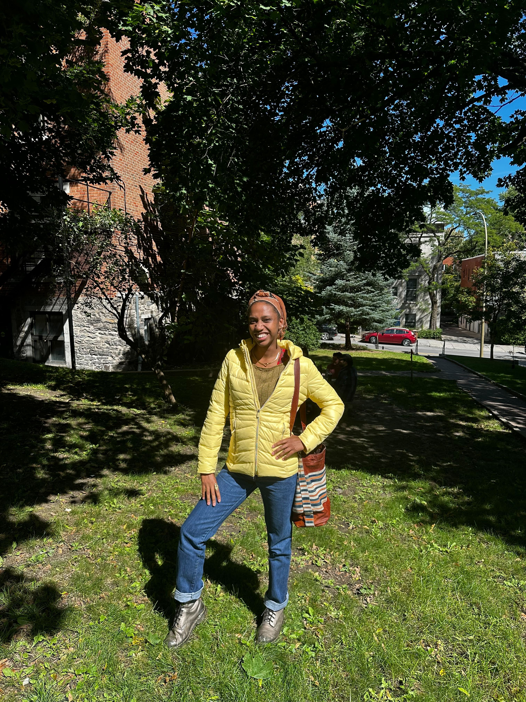
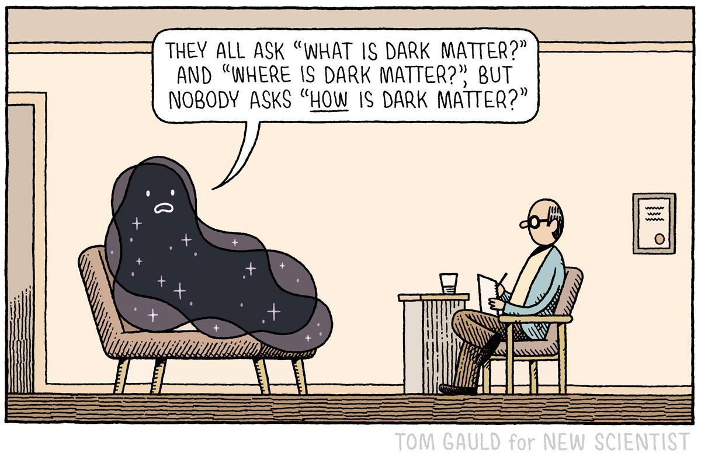

#Afura Taylor, Physics Graduate Student!

{align="left": style="height:200;width:200px"}
##Welcome! Bienvenue!
Hello, good day! My name is Afura Taylor and I’m a first year physics graduate student at McGill University. Since I’m young, I have wanted to study space, so I am lucky to be a part of Katelin Schutz’s [group](https://katelinschutz.com/) here. Outside of physics, I like to dance and read. 

For my undergraduate degree, I studied at MIT, obtaining a physics and creative writing degree. While there, I was grateful to do research with Prof. Kerstin Perez and Prof. Tracy Slatyer. In addition, I participated in the LIGO REU, working at Caltech’s TAPIR group with Prof. Vijay Varma. You can learn more about my research [here](./reasearch/index.md)!

If you'd like to read about me, you can find some more info [about me](./about/index.md).

## Perspective.... 

This cartoon was created by Tom Gauld for [New Scientist](https://www.newscientist.com/article/2267304-tom-gauld-has-a-heart-to-heart-with-dark-matter/).