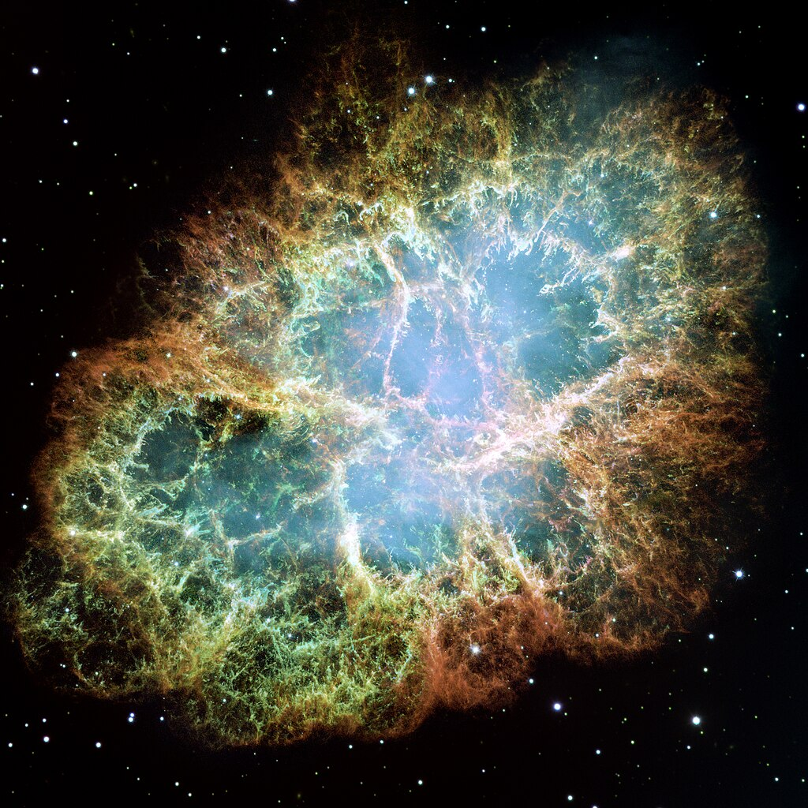

# Welcome to My Research Page

{align="left": style="height:150;width:150px"}
Welcome! My name is Afura Taylor and I'm a physics graduate student at McGill University. Outside of my physics research, which is detailed in the Research page, I enjoy dancing, cooking, and gardening! I'm from the United States of America, but I have been enjoying my time in Quebec so far. 

Before coming to McGill, I was working as an instructor for Inspirit AI, an online machine learning camp. Before that, and a couple of jobs here and there, I was a physics undergraduate at MIT. There, I worked with Prof. Tracy Slatyer and Prof. Kerstin Perez at MIT and Prof. Vijay Varma at Caltech. 

If you're like to learn more about me, you can find an introduction to [my research](./reasearch/research_index.md), some info on some [recent projects](./projects/project_index.md) and some more info [about me](./about/about.md).

## Here is an equation

$$ x = \frac{-b \pm \sqrt{b^2 -4ac}}{2a}$$

## Here is the Crab Nebula

I got this image from [Wikipedia](https://en.wikipedia.org/wiki/Crab_Nebula).