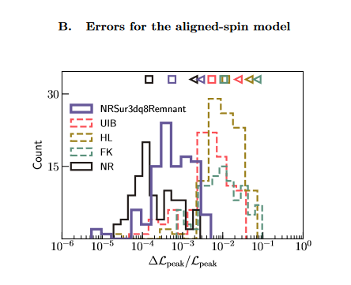

# Gravitational wave peak luminosity model for precessing binary black holes

Here is a brief summary of my paper which is published [here](https://arxiv.org/abs/2010.00120). This paper was the result of the work I completed as an REU student of the LIGO SURF in Caltech's TAPIR group. I worked with Prof. Vijay Varma and created a model of the peak luminosity of binary black hole mergers utilizing Numerical Relativity simulations and machine learning techniques. 

Through our work, we created a model that had an order of magnitude increase in accurary of peak luminosity prediction compared to the top analytical models utilized by the LIGO collaboration. 

Here is an interesting figure from this paper:

